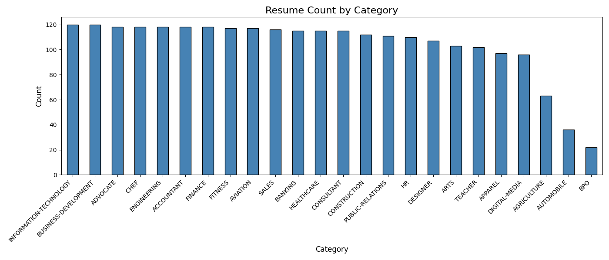
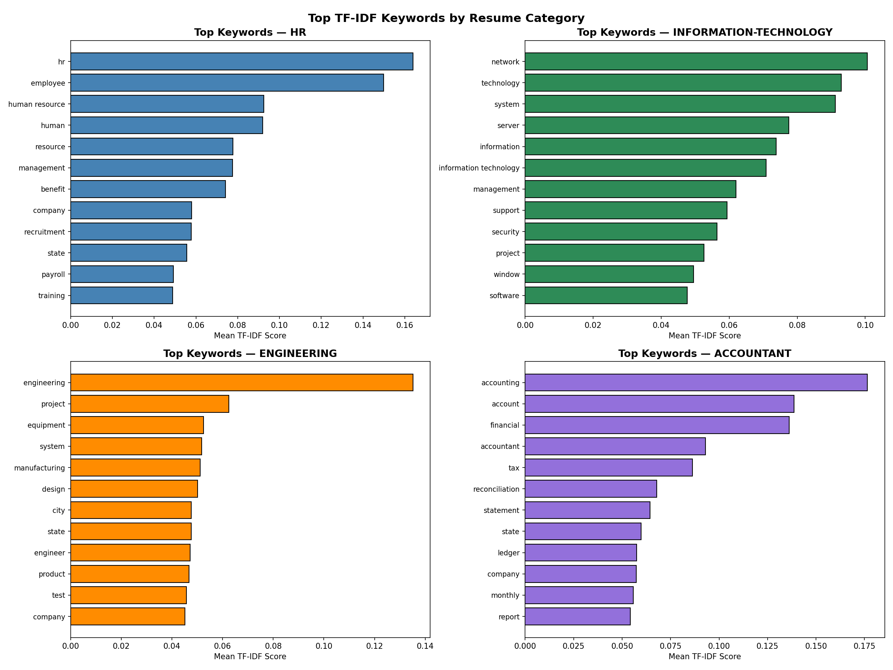
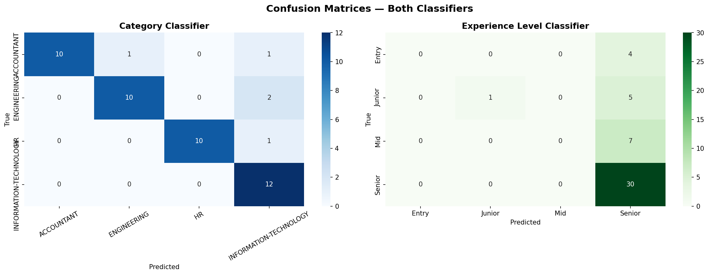
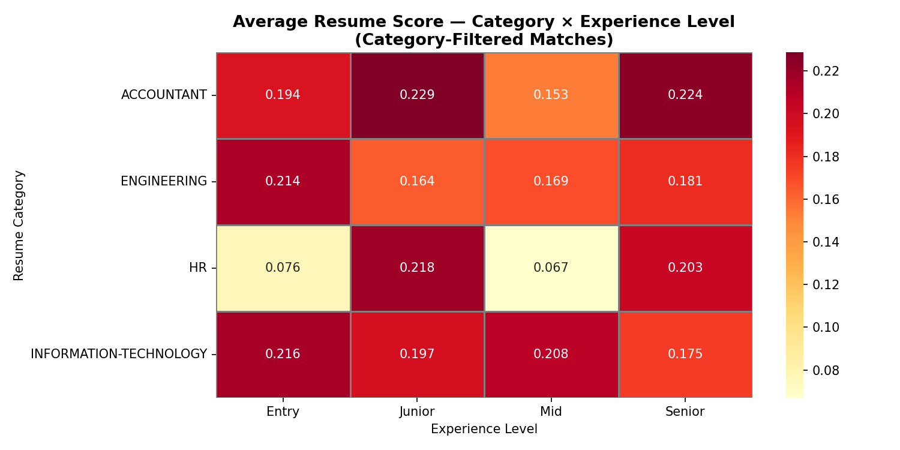

# 🧠 Deep Learning on Text Data — Recruitment & HR NLP Project

---

## 📌 Project Overview

This project applies **neural network techniques** to recruitment text data — resumes and job descriptions — to explore:
- Resume classification by **job domain** and **experience level**
- **Keyword extraction** to understand what skills matter per domain
- **Candidate–job matching** using cosine similarity

All work is done in Jupyter notebook using Python, TensorFlow/Keras, scikit-learn, and NLTK.

---

## 📂 Project Structure

```
recruitment-nlp/
│
├── data/
│   ├── raw/
│   │   ├── Resume.csv                        ← 2,484 resumes, 25 categories
│   │   └── job_descriptions.csv              ← 1,615,940 job postings
│   └── processed/
│       ├── resumes_cleaned.csv               ← Preprocessed resume text
│       ├── jobs_cleaned.csv                  ← Preprocessed job text (50K sample)
│       ├── resume_with_levels.csv            ← Resumes + inferred experience levels
│       ├── resume_tfidf_vectorizer.pkl       ← Fitted TF-IDF for resumes
│       ├── job_tfidf_vectorizer.pkl          ← Fitted TF-IDF for jobs
│       ├── shared_tfidf_vectorizer.pkl       ← Shared vectorizer for matching
│       ├── resume_tfidf_matrix.npz           ← Sparse resume TF-IDF matrix
│       ├── job_tfidf_matrix.npz              ← Sparse job TF-IDF matrix
│       ├── label_encoder.pkl                 ← Category label encoder
│       └── exp_level_encoder.pkl             ← Experience level encoder
│
├── results/
│   ├── models/
│   │   ├── best_category_classifier.keras    ← Best category model weights
│   │   └── best_exp_classifier.keras         ← Best experience model weights
│   ├── metrics/
│   │   ├── all_matches.csv                   ← Unfiltered resume–job matches
│   │   └── filtered_matches.csv              ← Domain-filtered matches
│   └── plots/                                ← All generated PNG charts
│
├── notebooks/
│   ├── 01_data_exploration.ipynb
│   ├── 02_preprocessing.ipynb
│   ├── 03_keyword_extraction.ipynb
│   ├── 04_classification.ipynb
│   ├── 05_matching.ipynb
│   ├── 06_summary_report.ipynb
│
├── NLP_Recruitment_Project_Report.docx       ← Full project report
└── README.md
```

---

## 📓 Notebooks

| # | Notebook | What it does |
|---|---|---|
| 01 | `01_data_exploration.ipynb` | Load datasets, inspect structure, visualize distributions |
| 02 | `02_preprocessing.ipynb` | Clean text, tokenize, remove stopwords, lemmatize, save |
| 03 | `03_keyword_extraction.ipynb` | TF-IDF vectorization, keyword charts, word clouds |
| 04 | `04_classification.ipynb` | Train MLP classifiers for category and experience level |
| 05 | `05_matching.ipynb` | Cosine similarity resume–job matching across 23.3M pairs |
| 06 | `06_summary_report.ipynb` | Aggregated metrics, observations, final summary |

> **Run notebooks in order 01 → 06.** Each notebook loads artifacts saved by the previous one.

---

## 🗂️ Dataset Summary

| Dataset | Rows | Columns | Text Column | Label |
|---|---|---|---|---|
| Resume.csv | 2,484 | 4 | `Resume_str` | `Category` |
| job_descriptions.csv | 1,615,940 | 23 | `Job Description` + `skills` + `Responsibilities` | `Job Title` |

**4 target domains used:**

| Label | Category | Resumes |
|---|---|---|
| HR / Management | `HR` | 110 |
| Finance / Accounting | `ACCOUNTANT` | 118 |
| Engineering | `ENGINEERING` | 118 |
| IT / Software | `INFORMATION-TECHNOLOGY` | 120 |

---

## ⚙️ Text Preprocessing Pipeline

```
Raw Text
  │
  ├── 1. Handle nulls / missing values
  ├── 2. Lowercase
  ├── 3. Remove special characters, numbers, punctuation
  ├── 4. Tokenize (NLTK word_tokenize)
  ├── 5. Remove English stopwords
  └── 6. Lemmatize (WordNetLemmatizer)
         │
         └── cleaned_text  ──► saved to data/processed/
```

---

## 📊 Key Results

### Resume Category Distribution


### TF-IDF Keywords Per Category


### Word Clouds Per Resume Category


### Category Classifier — Training Curves


### Experience Level Classifier — Training Curves


### Confusion Matrices


### Resume–Job Similarity Score Distribution


### Match Quality Heatmap — Category × Experience Level


### Top Matched Job Titles Per Resume Category


---

## 🧠 Model Architecture

Both classifiers use the same feedforward MLP:

```
Input (5,000 TF-IDF features)
    │
    ├── Dense(512, ReLU) → BatchNorm → Dropout(0.4)
    ├── Dense(256, ReLU) → BatchNorm → Dropout(0.3)
    ├── Dense(128, ReLU) → BatchNorm → Dropout(0.3)
    │
    └── Dense(4, Softmax)   ← 4 output classes
```

| Classifier | Input | Output Classes |
|---|---|---|
| Category | 5,000 TF-IDF | HR / ACCOUNTANT / ENGINEERING / IT |
| Experience Level | 5,000 TF-IDF | Entry / Junior / Mid / Senior |

**Training:** Adam optimizer, `categorical_crossentropy` loss, EarlyStopping + ReduceLROnPlateau callbacks.  
**Class imbalance fix (Experience):** `compute_class_weight('balanced')` + `batch_size=16`.

---

## 🔗 Resume–Job Matching

| Item | Detail |
|---|---|
| Vectorization | Shared TF-IDF (8,000 features) on all 50,466 documents |
| Similarity | Cosine similarity |
| Scale | 50,000 jobs × 466 resumes = **23.3 million pairs** |
| Output | Top-5 matching resumes per job with similarity scores |
| Mean top-1 score | 0.1968 (unfiltered) |
| Category filtering | Domain-constrained shortlisting for domain-relevant results |

---

## 🔧 Setup & Requirements

```bash
pip install pandas numpy matplotlib seaborn scikit-learn nltk tensorflow wordcloud scipy
```

**NLTK downloads required (run once):**
```python
import nltk
nltk.download('stopwords')
nltk.download('punkt')
nltk.download('wordnet')
nltk.download('omw-1.4')
nltk.download('punkt_tab')
```

---

## 💡 Suggestions for Future Work

- **Semantic embeddings:** Replace TF-IDF with Word2Vec, GloVe, or `sentence-transformers` (`all-MiniLM-L6-v2`) for better semantic matching
- **More data:** Collect 500+ labeled resumes per category for improved classifier generalization
- **FAISS indexing:** Use approximate nearest-neighbor search for scalable matching across millions of resumes
- **LSTM / Transformer:** Add sequence-aware layers to capture word order and contextual meaning
- **Ground truth labels:** Collect recruiter feedback on matches to build a supervised matching model
- **SMOTE:** Apply oversampling on minority experience level classes (Entry, Junior) to reduce class imbalance effects

---

## 📄 Report

A full project report is available in [`NLP_Recruitment_Project_Report.docx`](NLP_Recruitment_Project_Report.docx) covering:
- Data overview and preprocessing steps
- Model architecture and training methodology
- Evaluation metrics and confusion matrices
- Key observations and improvement suggestions

---

*nisansala Ruwanpathirana*
